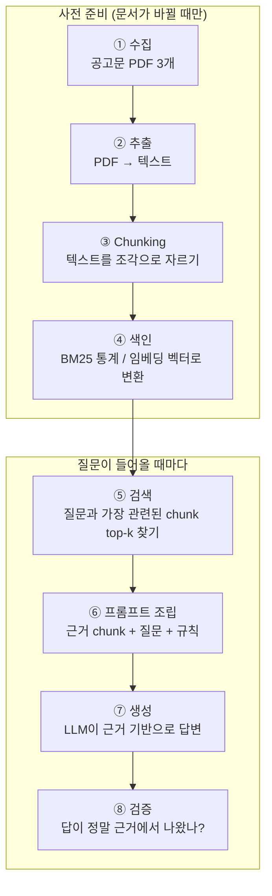

# 03. RAG 기초 — gongo-rag가 만들 것의 전체 그림

> 읽는 시점: Week 1, 코드 시작 전. **이 문서의 그림이 12주 내내 머릿속 지도가 됩니다.**

## 1. 어떤 문제를 푸는가

LLM에게 "청년창업사관학교 신청 자격이 뭐야?"라고 물으면:

- 모델은 그 공고문을 **본 적이 없습니다** (학습 데이터에 없음 / 최신 공고임)
- 그런데도 LLM은 침묵하는 대신 **그럴듯하게 지어냅니다** (환각)

해결 아이디어가 RAG(Retrieval-Augmented Generation, 검색 증강 생성)입니다:

> **"시험을 오픈북으로 바꾸자."**
> 질문이 들어오면 → 내 문서에서 관련 부분을 **검색(Retrieval)** 해서 → 그걸 프롬프트에 **첨부(Augmented)** 하고 → 모델은 그 근거를 보고 **답변(Generation)** 만 하게 한다.

## 2. 전체 파이프라인 — 8단계

각 단계와 여러분이 만들 파일의 대응:

| 단계 | 하는 일 | 파일 | 누가 만드나 |
|---|---|---|---|
| ① 수집 | 공고문 PDF 다운로드 | `docs/raw/` | 여러분 (손으로) |
| ② 추출 | PDF → 텍스트 | `src/extract_pdf.py` | ✅ 완성 제공 (배관) |
| ③ Chunking | 검색 가능한 조각으로 자르기 | `src/chunker.py` | ✍️ 직접 구현 |
| ④⑤ 색인+검색 | 키워드 방식 | `src/bm25.py` | ✍️ 직접 구현 |
| ④⑤ 색인+검색 | 의미 방식 | `src/embeddings.py` | ✍️ 직접 구현 (모델 호출은 제공) |
| ⑥⑦ 조립+생성 | 프롬프트 + LLM 호출 | `src/rag_answer.py` | ✅ 배관 제공, 검증은 직접 |
| ⑧ 평가 | hit rate@k, 골든셋 | `src/evaluate.py` | ✍️ 직접 구현 |

## 3. 왜 자르는가 (chunking) — 통째로 넣으면 안 되나?

1. **컨텍스트 윈도우 한계**: 문서 전체는 창에 안 들어갈 수 있음
2. **검색 정밀도**: "신청 기한" 질문에 30페이지 전체를 주면 모델이 헤맴. 기한이 적힌 문단만 주는 게 정확
3. **비용**: 토큰 수 = 돈

핵심 트레이드오프 (7주차 실험 주제):
- chunk가 **너무 작으면** → 문맥이 잘려서 답에 필요한 정보가 흩어짐
- chunk가 **너무 크면** → 관련 없는 내용이 섞여 검색이 둔해지고, top-k 안에 다양한 후보를 못 넣음

## 4. 두 가지 검색 방식 — 이 프로젝트의 심장

| | BM25 (키워드 검색) | Embedding (의미 검색) |
|---|---|---|
| 원리 | 질문의 단어가 chunk에 얼마나/얼마나 희귀하게 등장하나 | 질문과 chunk를 숫자 벡터로 바꿔 방향이 비슷한지 |
| 강점 | 고유명사, 금액, 코드명 등 **정확한 키워드** | 표현이 달라도 **의미가 같으면** 찾음 |
| 약점 | "지원금" ↔ "보조금" 못 연결 | "5천만원" 같은 정확한 값에 둔감할 수 있음 |
| 학습 필요 | ❌ 통계만 계산 | 임베딩 모델 필요 (가져다 씀) |

> 6주차 실험에서 "어떤 유형의 질문에 뭐가 강한가"를 **여러분의 데이터로 직접 증명**하는 것 — 이게 포트폴리오의 메인 콘텐츠입니다. 심화: [04-concepts/BM25-완전정복.md](../04-concepts/BM25-완전정복.md), [04-concepts/임베딩-완전정복.md](../04-concepts/임베딩-완전정복.md)

## 5. 각 단계의 실패 모드 (4주차 관문 질문의 답)

"RAG는 어떤 단계로 동작하고, 각 단계에서 뭐가 실패할 수 있는가?"

| 단계 | 대표 실패 | 실제 예 |
|---|---|---|
| ② 추출 | 표가 깨짐, 줄바꿈 엉킴 | "창업 3년 이내" 조건이 표 안에 있어 문장이 조각남 → **데이터 문제** |
| ③ Chunking | 정답 문장이 chunk 경계에서 반토막 | 자격 요건의 앞부분과 뒷부분이 다른 chunk로 |
| ⑤ 검색 | 정답 chunk가 top-k에 없음 | 질문은 "보조금", 문서는 "지원금" → **검색 실패** |
| ⑦ 생성 | 정답 chunk를 주고도 딴소리/환각 | 3개 chunk 중 엉뚱한 것을 근거로 답변 → **생성 실패** |
| ⑧ 검증 | 없는 근거를 인용했다고 표시 | 답변의 금액이 어느 chunk에도 없음 |

> **실패를 "검색 실패 / 생성 실패 / 데이터 문제"로 분리하는 습관** — 계획서가 8주차에 요구하는 것이고, 면접에서 가장 강력한 무기입니다. "품질이 안 좋아요"가 아니라 "top-3 재현율은 85%인데 생성 단계에서 12%가 무너집니다"라고 말하는 사람이 되는 것.

## 6. 자주 나오는 확장 개념 (지금은 이름만)

- **hybrid search**: BM25 점수 + 임베딩 점수를 결합 (7주차 실험)
- **reranking**: 1차 검색으로 후보 20개 → 더 정밀한 모델로 재정렬해 top-3 선발. *후보는 많은데 상위권이 부정확할 때* 필요
- **벡터 DB** (Pinecone, pgvector 등): 벡터 수백만 개를 빠르게 검색하는 전용 저장소. **문서 3개짜리 우리 프로젝트엔 numpy면 충분** — "왜 안 썼나"를 설명할 수 있는 게 쓴 것보다 낫습니다

## 다음 할 일

→ `02-gongo-rag/README.md` 열고 프로젝트 시작
