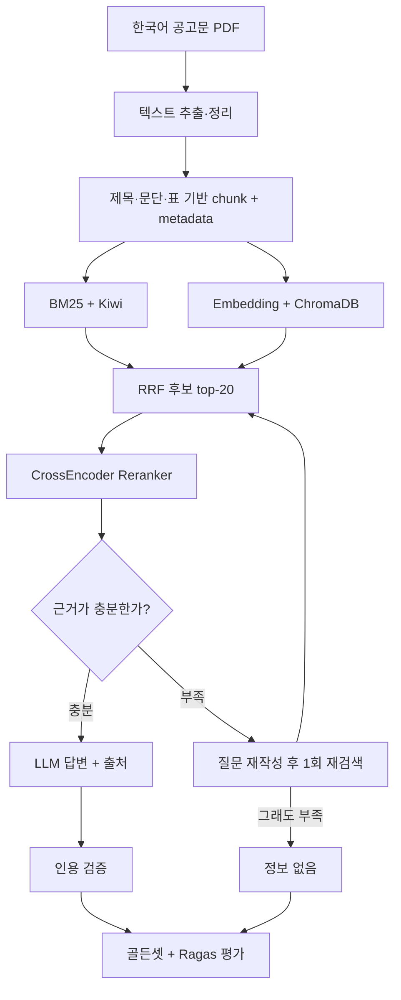

# 🧭 RAG 전체지도 — 이것만 보고 길을 찾기

> 이 문서는 `gongo-rag`의 **전체 그림, 만드는 이유, 꼭 이해할 것, 현재 위치, 남은 할 일**을 한곳에 모은 마스터 문서다.
>
> **진행 체크는 이 문서에서만 한다.**

> 일정이 필요하면 [12주 일정표](00-plan/ROADMAP.md), 실험할 때는 [gongo-rag 실험가이드](https://github.com/hamjinoo/gongo-rag/blob/main/experiments/실험가이드.md)를 필요할 때만 연다.

마지막 갱신: 2026-07-20

---

## 30초 요약

RAG는 **책을 다 외우는 로봇**이 아니라, 질문을 받으면 책에서 관련 페이지를 찾아 읽고 답하는 로봇이다.

```text
문서를 잘게 정리해 둔다
→ 질문과 관련된 조각을 넓게 찾는다
→ 정말 도움이 되는 조각을 다시 순서대로 세운다
→ 그 조각만 보고 답한다
→ 답이 맞는지 시험한다
```

이 프로젝트에서 얻어야 하는 것은 “챗봇 하나”가 아니다.

> **어디서 틀렸는지 찾고, 무엇을 바꿨더니 얼마나 좋아졌는지 설명하는 능력**

---

## 지금 어디에 있고, 다음은 무엇인가

```text
[완료] 직접 구현한 검색·평가 기반
   ↓
[지금] 평가셋 분리 + 공식 baseline
   ↓
[다음] LangChain + Chroma
   ↓
한국어 hybrid + reranker
   ↓
LangGraph 답변 제어
   ↓
Ragas 평가
   ↓
FastAPI·Docker·README
```

지금 할 일은 딱 세 가지다.

1. 골든셋을 `dev 24 / test 12`로 나눈다.
2. 현재 BM25·embedding 결과를 `exp01-baseline.md`에 저장한다.
3. baseline을 보존한 채 LangChain `Document` + Chroma 구조를 만든다.

---

## 도서관으로 이해하는 RAG

학교 숙제로 “청년 지원사업의 신청 자격과 지원 금액을 알려줘”라는 문제가 나왔다고 생각해보자.

| RAG 부품 | 도서관 비유 | 하는 일 |
|---|---|---|
| PDF 추출 | 책의 글자를 복사하기 | 컴퓨터가 읽을 수 있는 글자로 만든다 |
| Chunking | 긴 책에 포스트잇 붙이기 | 검색하기 좋은 작은 조각으로 나눈다 |
| Metadata | 포스트잇에 책·쪽·제목 적기 | 어디서 나온 내용인지 보존한다 |
| BM25 | 질문과 같은 단어 찾기 | 정확한 사업명·금액·날짜를 잘 찾는다 |
| Embedding | 비슷한 뜻 찾기 | 다른 표현으로 물어도 의미가 비슷한 조각을 찾는다 |
| Vector Store | 포스트잇 좌표 보관함 | embedding과 문서 정보를 저장하고 검색한다 |
| RRF | 두 명의 사서가 고른 목록 합치기 | BM25와 embedding의 장점을 합친다 |
| Reranker | 선생님이 후보를 다시 읽고 줄 세우기 | 후보 중 질문에 가장 도움 되는 조각을 위로 올린다 |
| LLM | 찾은 페이지를 읽고 답 쓰기 | 근거 안에서 자연어 답변을 만든다 |
| LangGraph | “근거가 부족하면 다시 찾아” 규칙표 | 검색·재시도·거절 흐름을 관리한다 |
| Evaluation | 채점표 | 무엇이 좋아졌고 어디서 틀렸는지 측정한다 |

---

## 전체 아키텍처



LangChain은 각 부품을 같은 방식으로 연결하는 도구다.

LangGraph는 “충분하면 답하고, 부족하면 한 번 더 찾고, 그래도 없으면 거절한다” 같은 **분기와 상태**를 관리한다.

---

## 무엇을 왜 만들고, 무엇을 이해해야 하나

### 1. 문서 준비

**왜 하나?**

PDF를 그대로 모델에게 던지면 표·줄바꿈·페이지가 깨지고, 필요한 위치를 찾기 어렵다.

**만들 것**

- PDF 텍스트 추출
- Unicode·공백 정규화
- 제목·문단·표를 고려한 chunk
- `doc_id`, 제목, 페이지, chunk 번호 metadata

**이해할 것**

- chunk가 너무 작으면 문맥이 끊긴다.
- 너무 크면 엉뚱한 내용이 섞이고 비용이 커진다.
- 답변에 출처를 보여주려면 metadata를 처음부터 보존해야 한다.

**얻는 것**

검색과 인용이 가능한 한국어 지식베이스.

---

### 2. 넓게 찾는 1차 검색

**왜 두 가지를 쓰나?**

- BM25는 `청년창업사관학교 15기`, `3년 이내`, `1억 원`처럼 정확한 글자에 강하다.
- Embedding은 `누가 신청할 수 있나요?`와 `지원 대상은 무엇인가요?`처럼 표현이 달라도 뜻이 비슷한 질문에 강하다.

**만들 것**

- 기존 BM25에 Kiwi 형태소 분석 선택지
- LangChain `Document` 형식
- ChromaDB Persistent vector store
- 한국어/다국어 embedding
- BM25와 Chroma 검색 결과를 합치는 RRF

**이해할 것**

- sparse 검색과 dense 검색의 차이
- embedding 모델과 vector store는 서로 다른 부품이라는 점
- ChromaDB는 답을 만드는 모델이 아니라 벡터와 문서를 저장·검색하는 저장소라는 점

**얻는 것**

정답이 있을 법한 후보 chunk 약 20개.

---

### 3. Reranker로 다시 줄 세우기

**왜 하나?**

1차 검색은 빠르게 넓게 찾는 대신 순서가 완벽하지 않다. Reranker는 질문과 후보 문서를 함께 읽고 관련성을 다시 계산한다.

**만들 것**

- 로컬 `CrossEncoder` reranker
- 기본 후보 `top-20 → 최종 top-3`
- 선택 비교: Cohere multilingual Rerank
- reranking 전후 성능과 지연시간 측정

**이해할 것**

- `SentenceTransformer` bi-encoder와 `CrossEncoder` reranker의 차이
- 정답이 후보 top-20에 없으면 reranker도 살릴 수 없다는 점
- 그래서 `후보 Hit@20`과 `리랭킹 후 Hit@3`를 따로 봐야 한다는 점

**얻는 것**

LLM에게 보여줄 가장 관련성 높은 근거 3개.

---

### 4. 답변 흐름을 LangGraph로 관리하기

**왜 하나?**

무조건 검색 한 번, 답변 한 번만 하면 근거가 약한 상황을 다루기 어렵다. 반대로 끝없이 다시 찾게 하면 느리고 비싸다.

**만들 것**

```text
질문 정리
→ 검색
→ rerank
→ 근거 충분성 판단
   ├─ 충분: 답변
   └─ 부족: 질문 재작성 후 1회 재검색
             └─ 그래도 부족: 정보 없음
→ 인용 검증
```

**이해할 것**

- LangGraph의 node는 하나의 작업이다.
- edge는 다음에 어디로 갈지 정하는 길이다.
- state는 질문·검색 결과·답변처럼 단계 사이에서 들고 다니는 가방이다.
- 재시도 횟수는 반드시 제한해야 한다.

**얻는 것**

답을 억지로 만들지 않고, 근거가 부족하면 다시 찾거나 거절하는 제어 가능한 흐름.

---

### 5. 답변 만들기와 인용 검증

**왜 하나?**

검색이 맞아도 LLM이 숫자나 날짜를 바꾸거나 엉뚱한 근거 번호를 붙일 수 있다.

**만들 것**

- 근거 안에서만 답하도록 하는 prompt
- 답이 없으면 정확히 `정보 없음`으로 거절
- 사용한 문서·페이지·chunk 표시
- 숫자·날짜가 근거에 존재하는지 검사

**이해할 것**

- 검색 성공과 답변 성공은 다른 문제다.
- 숫자 검증만으로 전체 답변의 진실성을 보장할 수 없다.
- 인용 번호가 있다고 근거 기반 답변인 것은 아니다.

**얻는 것**

출처를 확인할 수 있고, 모르면 모른다고 말하는 답변.

---

### 6. 평가

**왜 하나?**

예시 질문 한두 개가 잘 된다고 좋은 RAG라고 말할 수 없다.

**직접 만든 평가**

| 확인할 것 | 지표 |
|---|---|
| 후보 안에 정답이 들어왔나? | 후보 Hit@20 |
| reranker가 정답을 위로 올렸나? | 최종 Hit@1·3·5 |
| 답 없는 질문을 거절했나? | correct refusal |
| 숫자·날짜가 근거에 있나? | citation check |
| 느려지지 않았나? | retrieval·rerank·전체 latency |

**Ragas 평가**

- Faithfulness
- Factual Correctness
- Response Relevancy
- Context Precision / Recall

**이해할 것**

- 직접 만든 지표는 빠르고 결정적이다.
- LLM이 채점하는 Ragas 지표는 사람의 판단에 가깝지만 흔들릴 수 있다.
- 한국어 평가에서는 Ragas prompt를 한국어에 맞게 바꾸고 사람이 검토해야 한다.
- dev로 설정을 고르고 test는 마지막에 한 번만 사용한다.

**얻는 것**

“좋아진 것 같다”가 아니라 개선 전후 숫자와 실패 사례.

---

### 7. 서비스로 보여주기

**왜 하나?**

노트북이나 단일 스크립트만 있으면 다른 사람이 실행하고 확인하기 어렵다.

**만들 것**

- FastAPI 질문 API
- Docker 실행 환경
- 요청별 검색 방식·후보 수·지연·오류 로그
- 간단한 Streamlit 화면 또는 API 예시
- 재현 가능한 README

**이해할 것**

- API는 RAG를 다른 화면이나 서비스에서 사용할 수 있게 하는 문이다.
- Docker는 다른 컴퓨터에서도 같은 환경으로 실행하게 하는 상자다.
- 데모 디자인보다 실행 방법과 결과표가 중요하다.

**얻는 것**

채용 담당자가 실행하고, 개발자가 구조를 확인할 수 있는 포트폴리오.

---

## 최종 기술 스택

| 역할 | 주력 선택 | 선택·비교 |
|---|---|---|
| 연결 | LangChain | 직접 구현 baseline |
| 흐름 제어 | LangGraph | 단순 단계는 일반 Python 함수 |
| sparse 검색 | BM25 + Kiwi | 공백 분리 BM25 |
| dense 검색 | ChromaDB + embedding | 현재 ko-sroberta vs BGE-M3 |
| 검색 결합 | RRF | 단일 검색기 |
| reranking | 로컬 multilingual CrossEncoder | Cohere Rerank |
| 답변 | LLM + 근거 prompt | 모델 교체 가능 |
| 평가 | 골든셋 + 직접 지표 + Ragas | 사람 수동 검토 |
| 서비스 | FastAPI + Docker | Streamlit 데모 |

`/`로 적힌 도구를 전부 구현하는 것이 목표가 아니다. **한 가지를 주력으로 정하고, 다른 선택지는 비교가 필요할 때만 사용한다.**

---

## 내가 꼭 이해해야 하는 여섯 문장

아래를 내 말로 설명할 수 있으면 핵심을 이해한 것이다.

1. **Chunking:** 왜 문서를 나누며, 너무 작거나 크면 어떤 문제가 생기는가?
2. **BM25 vs embedding:** 정확한 글자 검색과 의미 검색은 왜 서로 다른 질문에서 강한가?
3. **Vector store:** embedding 모델과 ChromaDB는 각각 무엇을 하는가?
4. **Reranker:** 후보 검색과 최종 순위 결정은 왜 두 단계로 나누는가?
5. **LangGraph:** 어떤 조건에서 다시 검색하고 언제 `정보 없음`으로 끝내는가?
6. **Evaluation:** 검색 실패와 답변 실패를 어떻게 따로 측정하는가?

수식 전체와 라이브러리 내부 코드를 외울 필요는 없다. **입력, 출력, 실패 원인, 선택 이유**를 설명할 수 있어야 한다.

---

## 내가 직접 할 일과 Codex에 맡길 일

| 내가 직접 결정 | Codex에 맡겨도 됨 |
|---|---|
| 질문과 정답 검토 | LangChain·Chroma 연결 코드 |
| dev/test 분리 기준 | 공통 데이터 모델과 adapter |
| 실험 전 가설 | reranker·LangGraph 배관 |
| 어떤 지표로 채택할지 | FastAPI·Docker·설정 파일 |
| 실패 사례의 원인 | 평가 실행·결과표 생성 코드 |
| README의 결론과 한계 | README 구조·문장 다듬기 |

Codex가 구현한 코드는 다음 네 가지를 확인한다.

1. 입력과 출력이 무엇인가?
2. 실패하면 어디서 드러나는가?
3. 이 부품을 끄면 baseline으로 돌아갈 수 있는가?
4. 테스트와 평가 명령이 있는가?

---

## 현재 위치

### 이미 있는 기반

- [x] 한국어 공고문 PDF와 추출 텍스트
- [x] 고정 길이·문단 기반 chunking
- [x] 직접 구현한 BM25
- [x] 직접 구현한 embedding 검색과 cosine similarity
- [x] `hit_rate_at_k`, `no_answer_report`
- [x] 골든셋 36문항: 일반 30 + no-answer 6

현재 BM25@3 임시 결과는 일반 질문 기준 `16/30 = 53.3%`다. 아직 dev/test를 나누기 전이므로 최종 수치가 아니다.

### 지금 단계

> **학습용 직접 구현은 얼추 끝났다. 이제 baseline을 고정하고, 현업형 한국어 RAG로 조립할 차례다.**

---

# 해야 할 일 — 이 체크리스트만 사용

## 1단계 — 현재 성능을 기준점으로 저장

- [ ] 골든셋 36문항의 질문·정답·출처를 사람이 다시 확인
- [ ] dev 24문항 / test 12문항으로 분리
- [ ] 현재 BM25와 embedding의 Hit@1·3·5 측정
- [ ] 후보 Hit@20 측정
- [ ] 실패 문항 5개의 top-k chunk와 원문 확인
- [ ] `gongo-rag`의 `experiments/exp01-baseline.md` 작성

**완료 조건:** 현재 성능과 대표 실패 3건을 숫자와 사례로 설명할 수 있다.

## 2단계 — LangChain + Chroma 기반 만들기

- [ ] 모든 chunk를 LangChain `Document`와 공통 metadata 형식으로 변환
- [ ] ChromaDB Persistent collection 생성
- [ ] embedding 모델을 설정으로 교체할 수 있게 구성
- [ ] 현재 ko-sroberta와 BGE-M3를 dev에서 비교
- [ ] 기존 BM25와 Chroma retriever가 같은 결과 형식을 반환하게 연결
- [ ] 기존 직접 구현 baseline을 끄지 않고 선택 가능하게 유지

**완료 조건:** 같은 질문을 BM25와 Chroma에 보내 공통 `SearchResult` 목록을 받을 수 있다.

## 3단계 — 한국어 hybrid 검색과 reranker

- [ ] BM25 공백 분리와 Kiwi 전후 비교
- [ ] BM25와 dense 결과를 RRF로 합쳐 후보 top-20 생성
- [ ] 후보 Hit@20 측정
- [ ] 로컬 multilingual CrossEncoder reranker 추가
- [ ] 후보 top-20을 최종 top-3으로 재정렬
- [ ] reranking 전후 Hit@3과 지연시간 비교
- [ ] 필요할 때만 Cohere multilingual Rerank와 비교
- [ ] `exp02-retrieval.md` 작성

**완료 조건:** 정답 후보를 넓게 찾은 비율과 reranker가 위로 올린 비율을 따로 설명할 수 있다.

## 4단계 — LangGraph 답변 제어

- [ ] `normalize_query → retrieve → rerank → grade_context` node 구성
- [ ] 근거가 충분하면 답변 생성
- [ ] 부족하면 질문을 재작성하고 최대 1회 재검색
- [ ] 그래도 부족하면 `정보 없음`
- [ ] 답변에 문서·페이지·chunk 출처 표시
- [ ] 숫자·날짜 검증을 LangGraph 답변 결과에 연결
- [ ] 검색 실패와 생성 실패 로그 분리

**완료 조건:** 질문 하나가 어떤 node를 지나 답변 또는 거절에 도달했는지 로그로 설명할 수 있다.

## 5단계 — 한국어 Ragas 평가

- [ ] 정답성·인용·거절·완전성의 사람 채점 기준 작성
- [ ] Ragas metric prompt를 한국어에 맞게 조정하고 예시 검토
- [ ] Faithfulness·Factual Correctness·Response Relevancy 측정
- [ ] Context Precision·Recall 측정
- [ ] 사람 평가와 Ragas가 다르게 채점한 사례 확인
- [ ] test는 모든 결정을 마친 뒤 최종 1회 실행
- [ ] `exp03-answer-quality.md` 작성

**완료 조건:** 검색 지표, 답변 지표, LLM judge 지표의 차이와 한계를 설명할 수 있다.

## 6단계 — 포트폴리오로 공개

- [ ] FastAPI 질문 endpoint
- [ ] Docker 실행
- [ ] end-to-end 테스트
- [ ] 데이터 출처·모델명·버전·실행 조건 기록
- [ ] README에 아키텍처·결과표·실패 분석·한계 작성
- [ ] API 예시 또는 짧은 데모 GIF
- [ ] 이력서 불릿과 3분 프로젝트 설명 작성

**완료 조건:** 다른 사람이 README만 보고 실행하고, 결과와 한계를 확인할 수 있다.

---

## 지금 당장 할 세 가지

다른 문서를 더 읽지 말고 다음 순서로 시작한다.

1. 골든셋 36문항을 `dev 24 / test 12`로 나눈다.
2. 현재 BM25·embedding baseline을 `exp01-baseline.md`에 저장한다.
3. 그 baseline을 보존한 채 LangChain `Document` + Chroma 구조를 Codex에게 구현 요청한다.

Reranker는 3번 구조가 완성되고 `후보 Hit@20`을 잴 수 있을 때 붙인다.

---

## 지금 보지 않아도 되는 것

- LangGraph 내부 실행 엔진
- vector DB 여러 제품 비교
- reranker 파인튜닝
- Langfuse 대시보드
- Graph RAG
- multi-agent
- 로컬 LLM 여러 개 벤치마크
- 화려한 Streamlit 디자인

필요한 문제가 실제로 생기기 전에는 추가하지 않는다.

---

## 문서가 많아도 읽는 순서

| 상황 | 열 문서 |
|---|---|
| 전체 길을 잃었다 | **지금 보고 있는 이 문서** |
| 이번 작업을 몇 주에 나눌지 궁금하다 | [12주 일정표](00-plan/ROADMAP.md) |
| 실험 파일을 작성한다 | [gongo-rag 실험가이드](https://github.com/hamjinoo/gongo-rag/blob/main/experiments/실험가이드.md) |
| 개념 하나가 이해되지 않는다 | [기초](01-basics/) 또는 [심화 개념](04-concepts/)의 해당 문서 하나 |
| 코드를 수정한다 | [gongo-rag](https://github.com/hamjinoo/gongo-rag)의 해당 `src/*.py`와 관련 테스트 |
| 결과가 나왔다 | [이력서·JD 문서](05-career/포지셔닝-이력서-JD.md) |

`01-basics`와 `04-concepts`는 교과서처럼 처음부터 읽는 곳이 아니다. **막힌 개념 하나를 찾는 사전**이다.

---

## 공식 참고 링크

- [LangChain RAG 구조](https://docs.langchain.com/oss/python/langchain/retrieval)
- [LangGraph Agentic RAG](https://docs.langchain.com/oss/python/langgraph/agentic-rag)
- [Chroma Persistent Client](https://docs.trychroma.com/docs/run-chroma/cloud-client?lang=python)
- [Sentence Transformers Reranker](https://sbert.net/examples/cross_encoder/training/rerankers/README.html)
- [BGE multilingual reranker](https://huggingface.co/BAAI/bge-reranker-v2-m3)
- [Cohere multilingual Rerank](https://docs.cohere.com/docs/rerank-overview)
- [Ragas 평가 지표](https://docs.ragas.io/en/latest/concepts/metrics/available_metrics/)
- [Ragas 언어별 지표 적용](https://docs.ragas.io/en/stable/howtos/customizations/metrics/metrics_language_adaptation/)

---

## 최종 완주 문장

아래 문장을 내 숫자와 실패 사례로 설명할 수 있으면 완주다.

> 한국어 공고문을 구조에 맞게 나누고, Kiwi BM25와 Chroma 의미 검색을 결합해 후보를 찾았습니다. 다국어 CrossEncoder로 후보를 재정렬하고, LangGraph로 근거가 부족할 때 한 번만 재검색한 뒤 없으면 거절하도록 만들었습니다. 고정 골든셋의 Hit@k와 한국어로 조정한 Ragas 지표를 함께 사용해 검색과 답변 실패를 따로 분석했습니다.
